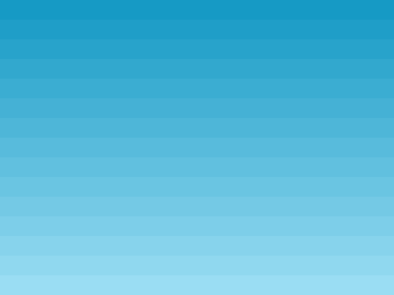

Vamos carregar assets que precisamos para o nosso jogo. Você faz isso fazendo chamadas ao Phaser Loader dentro de uma função da Scene chamada `preload`. O Phaser procurará automaticamente por essa função quando for iniciado e carregará qualquer coisa definida nela.

Atualmente, a função `preload` está vazia. Altere para:

```
function preload ()
{
    this.load.image('sky', 'assets/sky.png');
    this.load.image('ground', 'assets/platform.png');
    this.load.image('star', 'assets/star.png');
    this.load.image('bomb', 'assets/bomb.png');
    this.load.spritesheet('dude', 
        'assets/dude.png',
        { frameWidth: 32, frameHeight: 48 }
    );
}
```

Isto irá carregar 5 assets: 4 imagens e uma sprite sheet. Pode parecer óbvio para alguns de vocês, mas eu gostaria de mostrar o primeiro parâmetro, também conhecido como chave do asset (ou seja, 'sky', 'bomba'). Essa string é um link para o asset carregado e é o que você usará no seu código para criar Game Objects. Você está livre para usar qualquer string JavaScript válida como chave.

### Exibir uma imagem

Para exibir uma das imagens que carregamos, coloque o seguinte código dentro da função `create`:

`this.add.image(400, 300, 'sky');`

Você pode encontrar isso em `part3.html`. Se você abri-lo em um navegador, você deve ver uma tela de jogo com um plano de fundo de céu azul cobrindo-o:



Os valores `400` e` 300` são as coordenadas x e y da imagem. Por que 400 e 300? É porque no Phaser 3 todos os objetos do jogo são posicionados com base em seu centro por padrão. A imagem de fundo tem 800 x 600 pixels de tamanho, por isso, se fôssemos exibir ela centralizada em 0 x 0, veríamos apenas o canto inferior direito dela. Se o exibirmos em 400 x 300 você verá ela toda.

**Dica:** Você pode usar `setOrigin` para mudar isso. Por exemplo, o código: `this.add.image(0, 0, 'sky').setOrigin(0, 0)` irá redefinir a posição de desenho da imagem para o canto superior esquerdo. No Phaser 2, isso foi conseguido através da propriedade `anchor`, mas no Phaser 3 são as propriedades` originX` e `originY`.

A ordem em que os objetos do jogo são exibidos corresponde à ordem em que você os criou. Então, se você deseja colocar um sprite de uma estrela acima do fundo, você precisa garantir que ele foi adicionado como uma segunda imagem, após a imagem do céu:

```
function create ()
{
    this.add.image(400, 300, 'sky');
    this.add.image(400, 300, 'star');
}
```
Se você colocar a imagem `estrela` primeiro, ela será encoberta pela imagem do céu.
