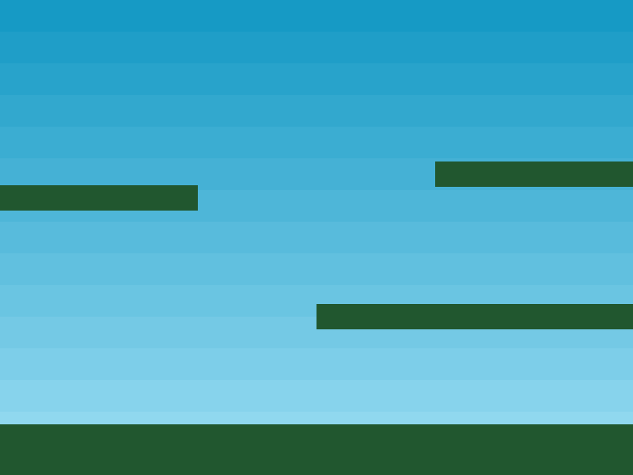

Por baixo dos panos `this.add.image` está criando um novo Game Object de Imagem adicionando-o à lista de exibição atual da Scene. Esta lista é onde todos os seus Game Objects vivem. Você poderia posicionar a imagem em qualquer lugar e o Phaser não se importaria. Claro, se estiver fora da região 0x0 a 800x600, você não o verá, porque estará "fora da tela", mas ainda existirá dentro da cena.

A cena em si não tem tamanho fixo e se estende infinitamente em todas as direções. O sistema de câmera controla sua visualização e você pode mover e aplicar zoom na câmera que está ativa conforme necessário. Você também pode criar novas câmeras para outras visualizações da cena. Este tópico está além do escopo deste tutorial, basta dizer que o sistema de câmeras no Phaser 3 é significativamente mais poderoso do que na versão 2. Coisas que não eram possíveis, agora são.

Por ora, vamos construir a Scene adicionando uma imagem de fundo e algumas plataformas. Aqui está a função `create` atualizada:

```
var platforms;

function create ()
{
    this.add.image(400, 300, 'sky');

    platforms = this.physics.add.staticGroup();

    platforms.create(400, 568, 'ground').setScale(2).refreshBody();

    platforms.create(600, 400, 'ground');
    platforms.create(50, 250, 'ground');
    platforms.create(750, 220, 'ground');
}
```

Em uma rápida olhada pelo código, você verá uma chamada para `this.physics`. Isso significa que estamos usando o sistema Arcade Physics, mas antes que possamos fazer isso, precisamos adicioná-lo ao nosso Game Config para informar ao Phaser que nosso jogo exige da física Arcade. Então, vamos atualizar-lo para incluir suporte à física. Aqui está a configuração do jogo revisada:

```
var config = {
    type: Phaser.AUTO,
    width: 800,
    height: 600,
    physics: {
        default: 'arcade',
        arcade: {
            gravity: { y: 300 },
            debug: false
        }
    },
    scene: {
        preload: preload,
        create: create,
        update: update
    }
};
```
A nova adição é a propriedade `physics`. Com este código no lugar, o qual você pode encontrar no arquivo zip do tutorial como `part4.html`, se você executá-lo você verá uma cena muito mais parecida com um jogo:



Temos um plano de fundo e algumas plataformas, mas como funcionam essas plataformas?
