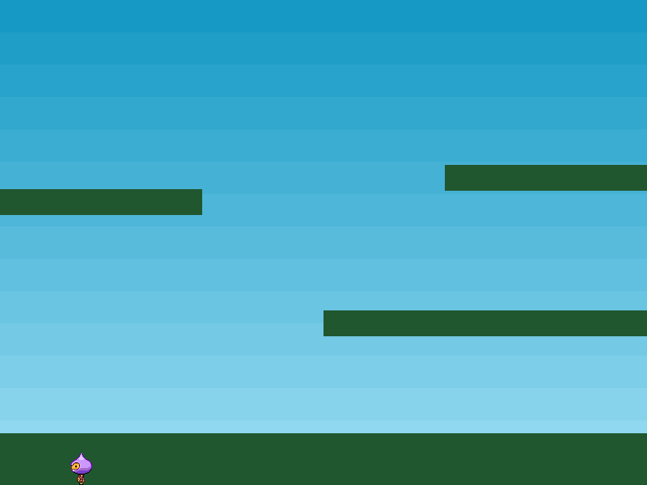
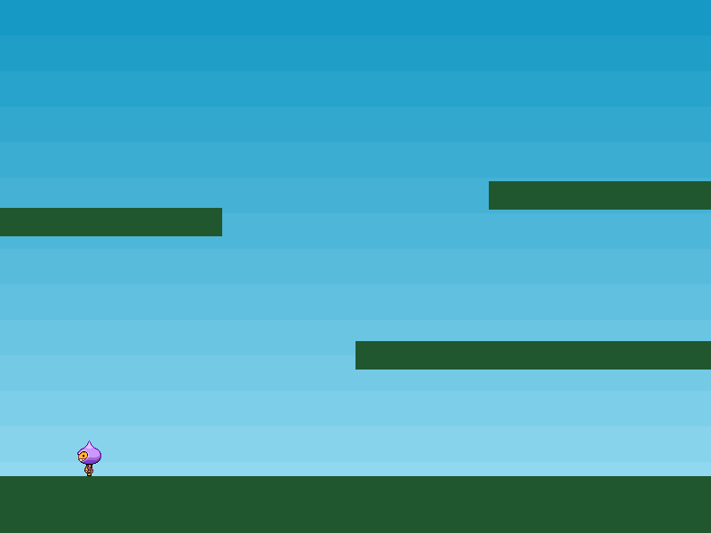

O Phaser tem suporte a uma variedade de diferentes sistemas de física, cada um atua como um plugin disponível para qualquer Scene do Phaser. No presente momento ele dispõe de Arcade Physics, Impact Physics e Matter.js Physics. Neste tutorial, usaremos o sistema Arcade Physics para o nosso jogo, que é simples e leve, perfeito para navegadores móveis.

Quando um Physics Sprite é criado, ele recebe uma propriedade `body`, que é uma referência ao seu Arcade Physics Body. Este representa o sprite como um corpo físico na engine Arcade Physics. O objeto body tem muitas propriedades e métodos os quais podemos brincar.

Por exemplo, para simular os efeitos da gravidade em um sprite, basta escrevermos:

`player.body.setGravityY(300)`

Este é um valor arbitrário, mas logicamente, quanto maior o valor, mais pesado seu objeto aparenta e mais rápido ele cai. Se você adicionar isso ao seu código ou executar `part5.html`, verá que o player cai sem parar, ignorando completamente o terreno que criamos anteriormente:



A razão para isso é que ainda não estamos testando a colisão entre o solo e o jogador.

Nós já dissemos ao Phaser que nosso solo e nossas plataformas seriam corpos estáticos. Se não tivéssemos feito isso e tivéssemos criado eles dinâmicos, quando o jogador colidisse com eles, pararia por um momento e então tudo teria desmoronado. Isto porque, a menos que seja dito o contrário, o sprite ground é um objeto físico em movimento e quando o jogador toca nele, a força resultante da colisão é aplicada ao ground, fazendo com que, os dois corpos troquem suas velocidades e o ground começa a cair também.

Para permitir que o jogador colida com as plataformas, podemos criar um objeto Collider. Esse objeto monitora dois objetos físicos (Groups também podem ser incluídos) e verifica colisões ou sobreposição entre eles. Se isso ocorrer, é possível opcionalmente, invocar seu callback, mas não exigimos isso apenas para colidir com as plataformas:

```
this.physics.add.collider(player, platforms);
```

O Collider é que realiza a magia. Recebe dois objetos, testa colisão e executa a separação contra eles. Neste caso, estamos passando o sprite do jogador e o grupo de plataformas. Ele é esperto o bastante para executar testes de colisões contra todos os membros do Grupo, portanto, esta chamada irá colidir contra o solo e todas as plataformas. O resultado é uma plataforma firme que não cai:


