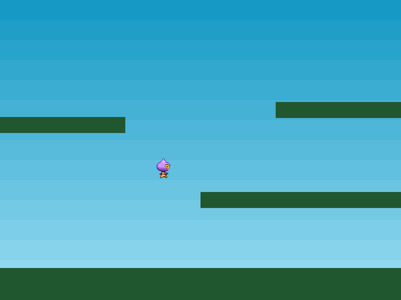

As Colisões agora vão muito bem, mas realmente precisamos que o jogador se mova. Você provavelmente pensaria em ir para a documentação e pesquisar como adicionar um event listener, mas isso não é necessário aqui. O Phaser tem um gerenciador de inputs do teclado integrado e um dos benefícios isto é essa pequena função:

`cursors = this.input.keyboard.createCursorKeys();`

Isso preenche o objeto de cursores com quatro propriedades: up, down, left, right, que são todas as instâncias do objeto Key. Então tudo o que precisamos fazer é chamar eles em nosso loop `update`:

```
if (cursors.left.isDown)
{
    player.setVelocityX(-160);

    player.anims.play('left', true);
}
else if (cursors.right.isDown)
{
    player.setVelocityX(160);

    player.anims.play('right', true);
}
else
{
    player.setVelocityX(0);

    player.anims.play('turn');
}

if (cursors.up.isDown && player.body.touching.down)
{
    player.setVelocityY(-330);
}
```

Embora tenhamos adicionado muito código, tudo deve ser bem legível.

A primeira coisa o código faz é verificar se a tecla esquerda está sendo pressionada. Se for o caso, aplicamos uma velocidade horizontal negativa e iniciamos a animação de execução 'left'. Se eles estão pressionando a tecla da direita, em vez disso, nós fazemos o oposto. Já que estamos resetando a velocidade e ajustando-a desta maneira, em cada quadro, cria-se um estilo de movimento "stop-start".

O sprite do jogador se moverá apenas quando uma tecla estiver pressionada e parará imediatamente quando não estiver. O Phaser também permite criar movimentos mais complexos, com impulso e aceleração, mas já temos o efeito que precisamos para este jogo. A parte final da verificação da tecla define a animação para 'turn' e zera a velocidade horizontal caso nenhuma tecla estiver pressionada.

### Pule nisso

A parte final do código adiciona a capacidade de pular. O cursor para cima é a nossa tecla de salto e testamos se está pressionada. No entanto, também testamos se o jogador está tocando o chão, se não fizermos isto, eles poderá pular no ar.

Se ambas as condições forem atendidas, aplicamos uma velocidade vertical de 330 px/seg. O jogador cairá no chão automaticamente por causa da gravidade. Com os controles configurados, agora temos um jogo que podemos explorar. Carregue a part7.html e jogue. Tente ajustar valores como o de pulo de 330 para valores mais baixos e mais altos e veja o efeito que ele terá.


