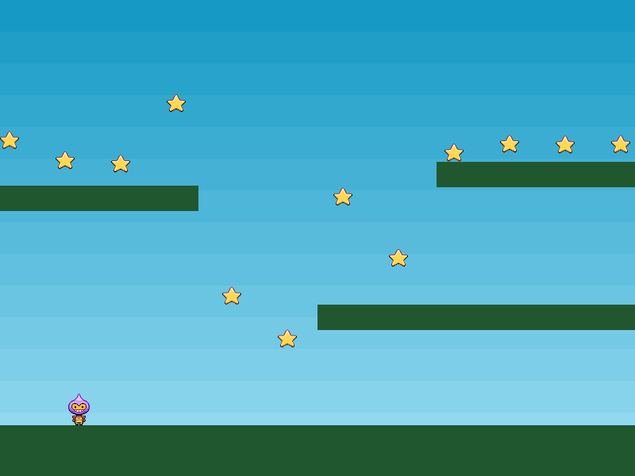

É hora de dar ao nosso joguinho um propósito. Vamos jogar algumas estrelas na cena e permitir que o jogador as colete. Para conseguir isso, criaremos um novo grupo chamado 'stars' e o preencheremos. Em nossa função create, adicionamos o seguinte código (isto poderá ser visto em `part8.html`):

```
stars = this.physics.add.group({
    key: 'star',
    repeat: 11,
    setXY: { x: 12, y: 0, stepX: 70 }
});

stars.children.iterate(function (child) {

    child.setBounceY(Phaser.Math.FloatBetween(0.4, 0.8));

});
```

Este processo é semelhante a quando criamos o grupo de plataformas. Como precisamos que as estrelas se movam e saltem, criamos um grupo dinâmico de física em vez de um estático.

Grupos são capazes de receber objetos de configuração para ajudar em sua inificalização. Neste caso, o objeto de configuração do grupo tem 3 partes: Primeiro, ele define a key de textura para ser a imagem de estrela. Isso faz com que filhos criados receberão essa textura por padrão. Em seguida, ele define o valor da propriedade repeat como 11. Pois, como ele cria um filho automaticamente, repetindo 11 vezes significa que obteremos 12 no total, o que é exatamente o que precisamos para o nosso jogo.

A parte final é `setXY` - isto é usado para definir a posição dos 12 filhos que o Grupo cria. Cada filho será posicionado começando em x: 12, y: 0 aumentando x em 70 a cada vez. Isso significa que o primeiro filho será posicionado em 12 x 0, o segundo será 70 pixels a diante, em 82 x 0, o terceiro está em 152 x 0 e assim por diante. A propriedade "step" é uma maneira realmente útil de espaçar um grupo de filhos durante a criação. foi escolhido o número 70 porque todos os 12 filhos estarão perfeitamente espaçadas em toda a tela.

A próxima parte do código itera por todos os filhos do grupo e fornece um valor de bounce Y aleatório entre 0,4 e 0,8. O intervalo de bounce é entre 0, sem ressalto, e 1, um ressalto total. Como as estrelas são todas geradas em y 0 a gravidade irá puxar elas para baixo até colidirem com as plataformas ou com o solo. O valor de bounce significa que eles retornarão aleatoriamente até que finalmente se acomodem.

Se fôssemos rodar o código como está agora, as estrelas iriam cair para baixo do jogo e sumiriam de vista. Para parar, precisamos checar sua colisão contra as plataformas. Podemos usar outro objeto Collider para fazer isso:

`this.physics.add.collider(stars, platforms);`

Além de fazer isso, também verificaremos se o jogador se sobrepõe a uma estrela ou não:

`this.physics.add.overlap(player, stars, collectStar, null, this);`

Isso diz ao Phaser para verificar se há sobreposição entre o player e qualquer estrela no grupo de estrelas. Se encontradas, elas são passadas para a função 'collectStar':

```
function collectStar (player, star)
{
    star.disableBody(true, true);
}
```

Bem simples, a estrela tem sua física desabilitada e seu Game Object pai fica inativo e invisível, removendo sua exibição. Rodando o jogo agora nos dá um player que pode correr, pular, saltar das plataformas e coletar estrelas que caem de cima. Nada mal para algumas linhas de código, na maior parte, espero que, bem legível :)


