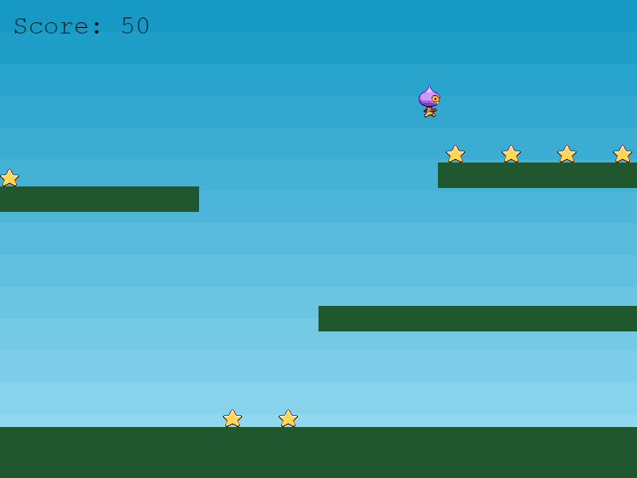

Há dois toques finais que vamos adicionar ao nosso jogo: um inimigo para evitar, que pode matar o jogador, e uma pontuação quando você coletar as estrelas. Primeiro, a pontuação.

Para fazer isso, vamos utilizar um Text Game Object. Criamos duas novas variáveis, uma para guardar a pontuação real outra para o próprio objeto de texto:

```
var score = 0;
var scoreText;
```
O `scoreText` foi configurado na função `create`:

`scoreText = this.add.text(16, 16, 'score: 0', { fontSize: '32px', fill: '#000' });`

16 x 16 é a coordenada em que o texto será exibito. 'score: 0' é a string padrão a ser exibida e o objeto a seguir contém o tamanho e cor da fonte. Ao não especificar qual fonte usaremos o Phaser utilizará seu padrão, que é Courier.

Em seguida, precisamos modificar a função `collectStar` para que, quando o jogador pegar uma estrela, sua pontuação aumente e o texto seja atualizado:

```
function collectStar (player, star)
{
    star.disableBody(true, true);

    score += 10;
    scoreText.setText('Score: ' + score);
}
```

Com isso 10 pontos são adicionados para cada estrela e o `scoreText` é atualizado para mostrar este novo total. Se você executar `part9.html`, verá as estrelas caírem e a pontuação aumentará conforme você as coleta.



Na parte final, vamos adicionar alguns vilões.
